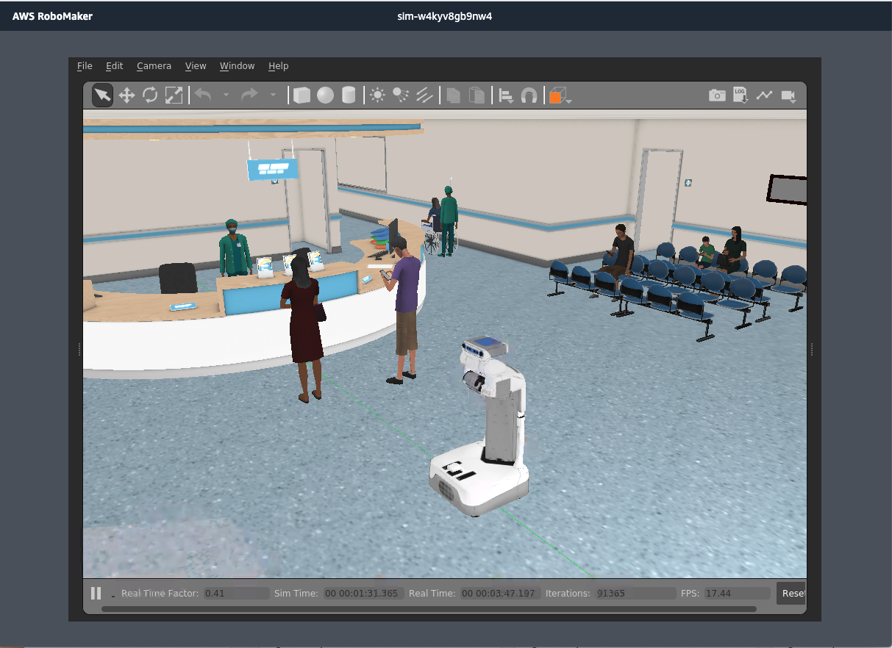

# AWS RoboMaker Sample Application - PR2 in a Hospital World

This demonstrates tests you would run in a hospital Gazebo world with PR2. 



_RoboMaker sample applications include third-party software licensed under open-source licenses and is provided for demonstration purposes only. Incorporation or use of RoboMaker sample applications in connection with your production workloads or a commercial products or devices may affect your legal rights or obligations under the applicable open-source licenses._

## Requirements

- [ROS Melodic](http://wiki.ros.org/melodic/Installation/Ubuntu) - Other versions may work, however they have not been tested
- [Colcon](https://colcon.readthedocs.io/en/released/user/installation.html) - Used for building and bundling the application.

## Build
### Install requirements
Follow links above for instructions on installing required software.

### Pre-build commands

```bash
sudo apt-get update
rosdep update
```

### Robot Application

```bash
cd robot_ws
rosdep install --from-paths src --ignore-src -r -y
colcon build
```

### Simulation Application

```bash
cd simulation_ws
rosws update
rosdep install --from-paths src --ignore-src -r -y
colcon build
```

## Run

Launch the application with the following commands:

- *Running Simulation Application in Tab 1:*
    ```bash
    source simulation_ws/install/local_setup.sh
    roslaunch pr2_hospital_simulation view_hospital.launch
    ```

- *Running Robot Application in Tab 2:*
    ```bash
    source robot_ws/install/local_setup.sh
    roslaunch pr2_hospital_robot pr2_2dnav.launch
    ```

## Using this sample with RoboMaker

You first need to install colcon-ros-bundle. Python 3.5 or above is required.

```bash
pip3 install -U setuptools
pip3 install colcon-ros-bundle
```

After colcon-ros-bundle is installed you need to build your robot or simulation, then you can bundle with:

```bash
# Bundling Robot Application
cd robot_ws
source install/local_setup.sh
colcon bundle
```

```bash
# Bundling Simulation Application
cd simulation_ws
source install/local_setup.sh
colcon bundle
```

This produces the artifacts `simulation_ws/bundle/output.tar` and `robot_ws/bundle/output.tar`.

You'll need to upload these two bundles to an s3 bucket, then you can use these files to
[create a robot application](https://docs.aws.amazon.com/robomaker/latest/dg/create-robot-application.html), [create a simulation application](https://docs.aws.amazon.com/robomaker/latest/dg/create-simulation-application.html),
and [create a simulation job](https://docs.aws.amazon.com/robomaker/latest/dg/create-simulation-job.html) in RoboMaker. This is a simulation application only, so you can skip the steps (13-19) that are for creating or using a robot application. 

You can also use the **RoboMaker Development Environment** (IDE). Once a development environment is open, simply clone this repository, then click **Add or Edit Configurations** in the top drop down menu. On the bottom of the pop-up window, click **Switch Config** and select the roboMakerSettings.json file provided in this repository. Then, open the simulation settings in the configuration settings window and select your IAM role and S3 buckets you want to use.

## License

MIT-0 - See LICENSE for further information

## How to Contribute

Create issues and pull requests against this Repository on Github
